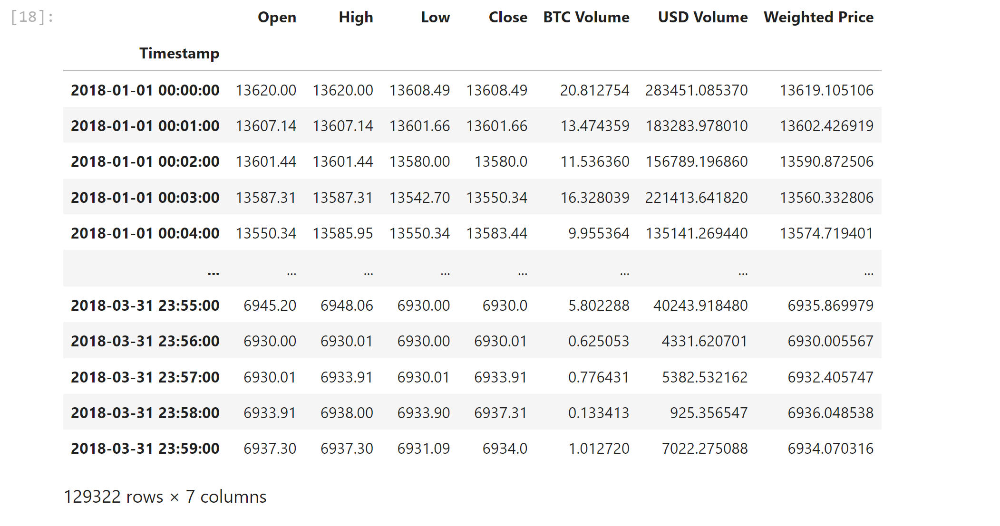
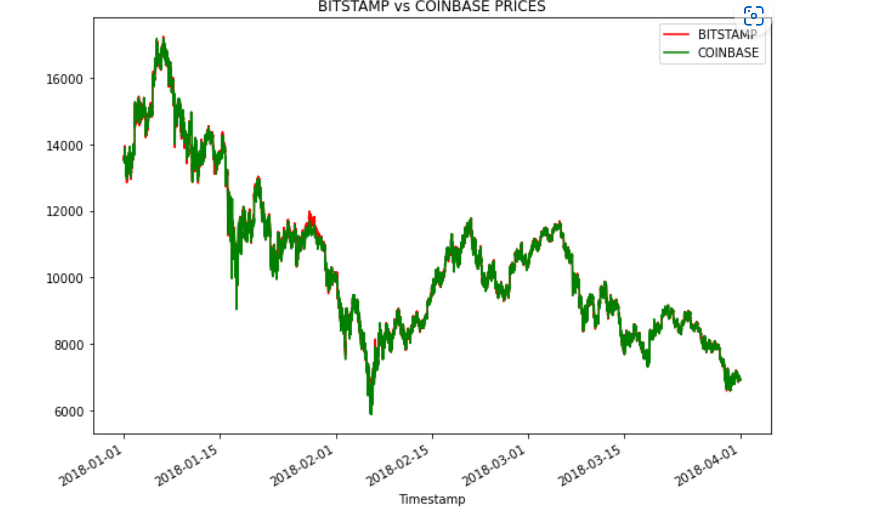
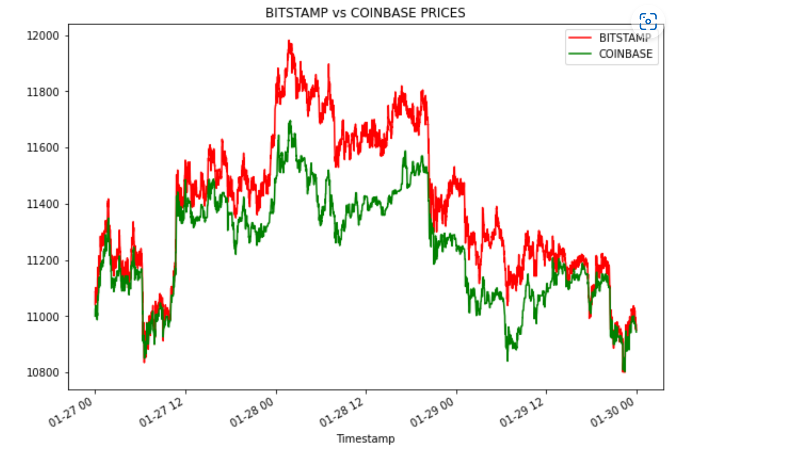
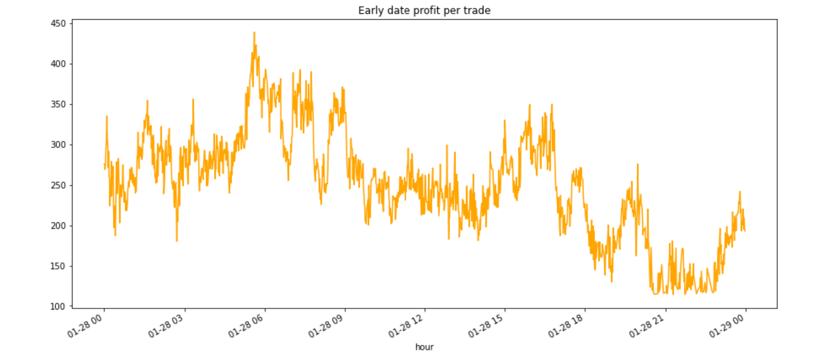

# Arbitrage Profits

## Use Case
This app uses BTC prices from Coinbase and Bitstamp and calculates profits that could have been made as arbitrage. It includes plots and profit calculations.

### Files used
 This application reads 2 csv files containing BTC prices, including Timestamp, and close prices which will be used to calculate arbitrage opportunities
    timestamp.csv

    coinbase.csv

---
## Technologies used
    Phyton Version: **3.7.13**

    Jupiter Notebook - Lab

## Libraries:

### CSV:
[csv](https://docs.python.org/3/library/csv.html)

### Pandas
[Pandas](https://pandas.pydata.org/pandas-docs/stable/reference/api/pandas.DataFrame.html) 

### Matplotlib
[Matplotlib](https://matplotlib.org/stable/api/_as_gen/matplotlib.pyplot.plot.html)

---
<!--How to run -->
## How to run

1. Clone the repository
2. Open the file with Jupiter Lab
3. Run each cell 

---
<!--Usage -->
## Usage

### Price data from Coinbase - sample:

### BTC prices for Coinbase and Bitstamp

###  BTC price difference for Coinbase and Bitstamp

###  Early Profit Per Trade

---

## Contributors
Startup code provided by UW FinTech Bootcamp Program

---
## License
Loan Qualifier App is available through the MIT License for education and training purposes.

---
## Aknowledgements
* [Markdown Guide](https://www.markdownguide.org/basic-syntax/#reference-style-links)
